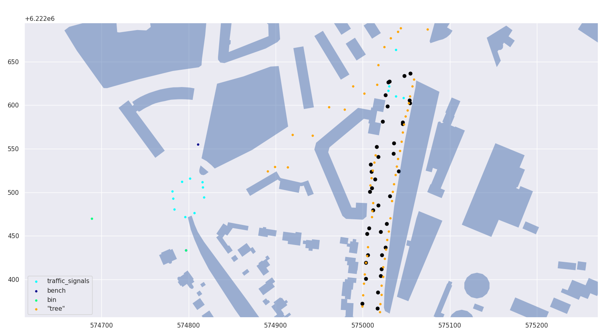
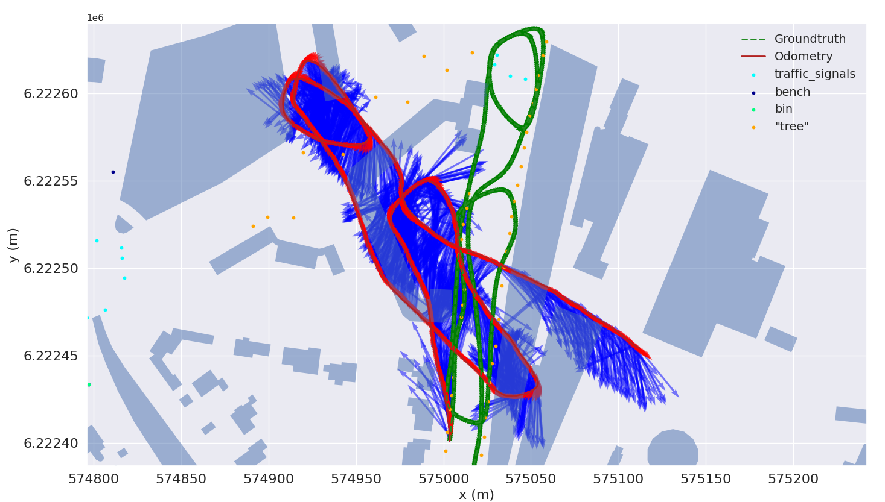

# Masters Project 2021
## Landmark-based graph-SLAM optimization for urban mobile robots.
### Made by Martin Jensen s164033 & Stefan C. Larsen s164029

## Running the simulator
Use the file: run_simulator.py to open and run the simulator. The output is a ground truth robot route and a data file in g2o format. These can be used to run the graph-SLAM algorithm. 
Chose between types of contraints: *pose-pose*, *pose-landmark*, or *bearing-only*. Moreover, if random generated outliers are wanted, set the variable `corrupt_dataset=True` and chose the amount of outliers generated using `n_outlier`.
  
## Follow this procedure to make your own data 
1. Select type of dataset; pose_only, landmark_only, or bearing_only.  
2. Use mouse-click to insert control points for the robot to visit. Then close the window when done.

Figures below shows an example of the process. Selected bearing_only and not outliers. Route length 955 m and 1374 landmark observations.

## Running the SLAM algorithm

After creating your own data file the ground truth and noisy route will be available and needs to be declared. 
In utils/linearize.py you can choose whether DCS for outlier downweighning should be active in the dcs bool.
In utils/slam_iterate.py the plotting functions are called and this is also where you can choose phi values for DCS and lambda for damping.
